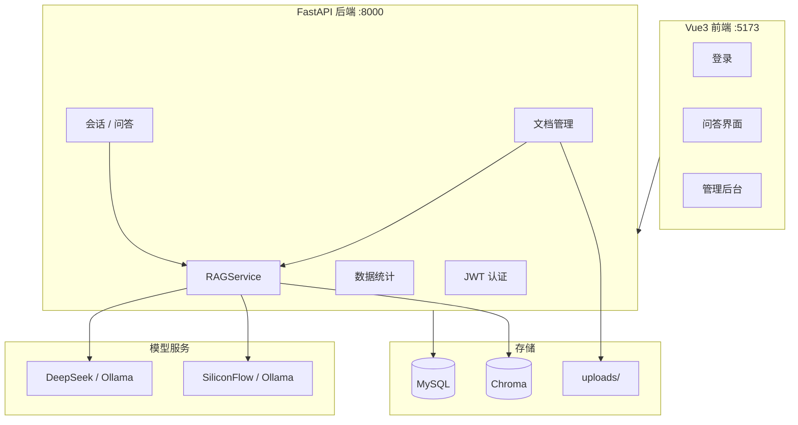

# 企业知识库 RAG 问答系统

基于 **FastAPI + LangChain + Chroma + Vue3** 的企业内部知识库问答 Agent 系统。支持文档上传、向量检索、多轮对话与引用来源展示，面向管理员与普通用户两种角色。

## 技术栈

| 层级 | 技术 |
|------|------|
| 后端 | Python 3.11、FastAPI、SQLAlchemy、LangChain |
| 前端 | Vue3、Vite、Element Plus、ECharts、Pinia、Axios |
| 关系库 | MySQL 8 |
| 向量库 | Chroma（本地持久化） |
| 大模型 | DeepSeek API（默认）/ Ollama 本地（可选） |
| 嵌入模型 | SiliconFlow 等 OpenAI 兼容 API（默认）/ Ollama Embedding（可选） |

## 系统架构



## 项目结构

```
主/
├── client/                         # Vue3 前端
│   ├── src/
│   │   ├── api/                    # Axios 接口封装
│   │   ├── router/                 # 路由与权限守卫
│   │   ├── stores/                 # Pinia 用户状态
│   │   └── views/
│   │       ├── Login.vue           # 登录页
│   │       ├── chat/Chat.vue       # 问答主界面
│   │       └── admin/              # 管理后台（首页图表 / 文档 / 用户）
│   └── vite.config.js              # 开发代理 /api → :8000
│
└── server/                         # FastAPI 后端
    ├── app/
    │   ├── main.py                 # 应用入口
    │   ├── config.py               # 环境变量配置
    │   ├── database.py             # 数据库连接
    │   ├── models/                 # ORM 模型
    │   ├── schemas/                # Pydantic 模型
    │   ├── routers/                # API 路由
    │   │   ├── auth.py             # 登录 / 当前用户
    │   │   ├── users.py            # 用户 CRUD（管理员）
    │   │   ├── documents.py        # 文档上传 / 删除
    │   │   ├── chat.py             # 会话 / 问答
    │   │   └── stats.py            # 统计图表数据
    │   ├── services/
    │   │   ├── rag_service.py      # RAG 核心（切片 / 检索 / 生成）
    │   │   ├── deepseek_api.py     # DeepSeek LLM + 远程 Embedding
    │   │   └── auth_service.py     # 认证业务
    │   └── utils/                  # JWT、日志、依赖注入
    ├── sql/
    │   ├── init.sql                # 建库建表
    │   └── test_data.sql           # 测试用户与会话数据
    ├── sample_docs/                # 示例文档（员工手册等）
    ├── uploads/                    # 上传文件存储
    │   └── samples/                # 推荐上传的样本文档
    ├── chroma_data/                # Chroma 向量持久化
    ├── logs/                       # 运行日志 app.log / error.log
    ├── .env.example                # 环境变量模板
    ├── environment.yml             # Conda 环境定义
    ├── install.bat                 # Windows 一键安装依赖
    ├── start.bat                   # Windows 启动脚本
    ├── init_users.py               # 初始化测试用户
    ├── run.py                      # 后端启动入口（推荐）
    └── requirements.txt
```

## 功能说明

### 角色权限

| 角色 | 能力 |
|------|------|
| **管理员 admin** | 数据统计图表、文档上传/删除、用户 CRUD、知识库问答 |
| **普通用户 user** | 知识库问答、会话管理、引用来源查看 |

### RAG 能力

- **文档入库**：支持 PDF、TXT、DOCX；自动切片、向量化写入 Chroma
- **智能切片**：`chunk_size=300`、`chunk_overlap=120`，提升关联内容（交通/住宿/加班等）的语义召回
- **编码兼容**：TXT 自动识别 UTF-8 / GBK 等常见编码
- **检索增强**：默认 Top-K=6，返回相似度得分
- **多轮对话**：结合最近 5 轮历史，检索与生成均感知上下文
- **提示词优化**：跨文档综合推理，主动关联班车、宿舍、补贴等配套信息
- **引用展示**：前端折叠面板展示来源片段、相似度百分比、换行正文

### RAG 流程

```
文档上传 → 文本加载 → 递归切片 → Embedding 向量化 → Chroma 存储
                                              ↓
用户提问 → 结合对话历史检索 → Top-K 片段 + 相似度 → LLM 生成回答 → 保存引用来源
```

## 环境准备

### 1. MySQL 8

确保 MySQL 运行在 `localhost:3306`（默认账号 `root/1234`，可在 `.env` 修改）。

```bash
mysql -u root -p1234 < server/sql/init.sql
mysql -u root -p1234 < server/sql/test_data.sql
```

若已建表但用户表为空，可执行：

```bash
cd server
conda activate rag-kb
python init_users.py
```

### 2. Python 环境

> **重要**：请使用 **Python 3.10 / 3.11**。Python 3.14 缺少 numpy 等预编译包，会导致安装失败。

**推荐：Windows 一键安装**

```bash
cd server
install.bat              # 创建 rag-kb 环境并安装依赖
conda activate rag-kb
copy .env.example .env   # 复制后填入 API Key
python run.py
```

**或 Conda 手动安装**

```bash
conda env create -f server/environment.yml
conda activate rag-kb
cd server
pip install -r requirements.txt
python run.py
```

**或双击启动**

```bash
server/start.bat
```

后端地址：http://127.0.0.1:8000  
API 文档：http://127.0.0.1:8000/docs

### 3. 模型配置（`.env`）

复制 `server/.env.example` 为 `server/.env`，按使用场景配置：

#### 方案 A：DeepSeek API + 远程 Embedding（默认，无需本地 GPU）

```env
LLM_PROVIDER=deepseek

# DeepSeek 对话模型（https://platform.deepseek.com）
DEEPSEEK_API_KEY=你的DeepSeek密钥
DEEPSEEK_MODEL=deepseek-v4-flash
DEEPSEEK_BASE_URL=https://api.deepseek.com/v1

# 远程 Embedding（SiliconFlow，https://cloud.siliconflow.cn）
EMBED_API_KEY=你的SiliconFlow密钥
EMBED_API_BASE_URL=https://api.siliconflow.cn/v1
EMBED_API_MODEL=BAAI/bge-m3
```

> DeepSeek 不提供 Embedding 接口，需单独配置 SiliconFlow 等 OpenAI 兼容 Embedding 服务。

#### 方案 B：Ollama 本地模型

```env
LLM_PROVIDER=ollama
OLLAMA_BASE_URL=http://localhost:11434
LLM_MODEL=qwen3:8b
EMBED_MODEL=qwen3-embedding:4b
```

```bash
ollama pull qwen3:8b
ollama pull qwen3-embedding:4b
ollama serve
```

#### RAG 调优参数（可选）

```env
RAG_CHUNK_SIZE=300        # 切片大小（字符）
RAG_CHUNK_OVERLAP=120     # 切片重叠
RAG_TOP_K=6               # 检索片段数
RAG_HISTORY_TURNS=5       # 多轮对话记忆轮数
```

修改切片参数后，需**重新上传文档**以重建向量。

### 4. 前端

```bash
cd client
npm install
npm run dev
```

浏览器访问：http://localhost:5173

开发模式下 `/api` 请求由 Vite 代理至 `http://127.0.0.1:8000`。

## 测试账号

| 用户名 | 密码 | 角色 |
|--------|------|------|
| admin | 123456 | 管理员 |
| user1 | 123456 | 普通用户 |
| user2 | 123456 | 普通用户 |

密码存储为 MD5：`e10adc3949ba59abbe56e057f20f883e`

## 快速体验

### 1. 上传知识库文档

管理员登录 → **管理后台 → 文档管理**，上传以下示例文件：

| 文件 | 说明 |
|------|------|
| `server/sample_docs/员工手册.txt` | 基础制度示例 |
| `server/uploads/samples/加班与晚下班配套制度.txt` | 加班、延时班车、宿舍留宿、交通补贴 |

上传成功后「切片数」应大于 0。若为 0，请检查文件是否为空或编码异常，并查看 `server/logs/app.log`。

### 2. 单轮问答

提问示例：

- 「公司的考勤制度是怎样的？」
- 「这家的薪资怎么样？」

### 3. 多轮关联问答

建议在同一对话中连续提问，验证上下文理解：

1. 「今天我下班晚了怎么办」
2. 「这里有班车接送吗」

系统应结合上一轮语境，说明正常班车时段、无延时班次，以及留宿/补贴等方案。

### 4. 查看引用来源

回答下方展开「引用来源」，可看到各片段标题、相似度得分与完整正文。

## API 概览

| 方法 | 路径 | 说明 | 权限 |
|------|------|------|------|
| POST | `/api/auth/login` | 用户登录 | 公开 |
| GET | `/api/auth/me` | 当前用户信息 | 登录 |
| GET | `/api/users` | 用户列表 | 管理员 |
| POST | `/api/users` | 创建用户 | 管理员 |
| PUT | `/api/users/{id}` | 更新用户 | 管理员 |
| DELETE | `/api/users/{id}` | 删除用户 | 管理员 |
| GET | `/api/documents` | 文档列表 | 管理员 |
| POST | `/api/documents` | 上传并向量化 | 管理员 |
| DELETE | `/api/documents/{id}` | 删除文档及向量 | 管理员 |
| GET | `/api/chat/sessions` | 会话列表 | 登录 |
| POST | `/api/chat/sessions` | 创建会话 | 登录 |
| DELETE | `/api/chat/sessions/{id}` | 删除会话 | 登录 |
| GET | `/api/chat/sessions/{id}/messages` | 会话消息 | 登录 |
| POST | `/api/chat/ask` | 知识库问答 | 登录 |
| GET | `/api/stats/overview` | 统计概览 | 管理员 |
| GET | `/api/stats/trend` | 统计趋势 | 管理员 |

完整接口文档：http://localhost:8000/docs

## 常见问题

### 登录无反应或 401

- 确认 MySQL 已启动且 `users` 表有数据
- 执行 `python init_users.py` 初始化测试账号
- 检查 `.env` 中 `MYSQL_PASSWORD` 是否正确

### 文档上传失败 / 切片数为 0

- 确认 `EMBED_API_KEY` 有效（DeepSeek 模式）
- TXT 文件勿为空；支持 UTF-8 / GBK 编码
- 查看 `server/logs/error.log` 具体报错

### Embedding 400 错误（code: 20015）

- SiliconFlow 的 BAAI 模型不支持 `dimensions` 参数，项目已使用自定义 `RemoteEmbeddings` 规避
- 确认 `EMBED_API_MODEL=BAAI/bge-m3` 且密钥有效

### 问答返回「未找到相关内容」

- 确认已上传相关文档且切片数 > 0
- 修改 RAG 参数或提示词后需重新上传文档
- 建议上传 `uploads/samples/加班与晚下班配套制度.txt` 补齐晚下班场景

### 无法连接后端

- 后端需在 `server/` 目录执行 `python run.py`
- 前端开发模式依赖 Vite 代理，后端须运行在 `:8000`

### Python 依赖安装失败

- 使用 `conda activate rag-kb`（Python 3.11）
- 或运行 `server/install.bat`

## 日志

| 文件 | 说明 |
|------|------|
| `server/logs/app.log` | 应用运行日志 |
| `server/logs/error.log` | 错误日志 |

## 生产部署建议

```bash
# 前端构建
cd client && npm run build

# 后端生产启动（关闭 reload）
cd server
uvicorn app.main:app --host 0.0.0.0 --port 8000
```

- 将 `.env` 中 `JWT_SECRET` 改为强随机字符串
- 生产环境配置 Nginx 反向代理与 HTTPS
- 定期备份 MySQL 与 `chroma_data/` 目录

## 许可证

本项目仅供学习与内部演示使用。
